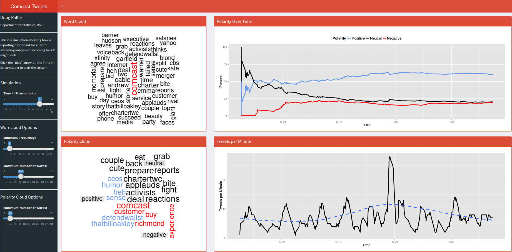

\pagebreak

# Overview
This handout contains some selected items and project overviews from my digital portfolio.  The full portfolio can be found on my personal website ([http://stat.wvu.edu/~draffle/portfolio.html](http://stat.wvu.edu/~draffle/portfolio.html)), which includes links to the final reports or apps.  All of the source code for these projects can also be found on my GitHub page ([https://github.com/raffled/](https://github.com/raffled/)).

# twitteRStorm: Streaming Analysis with Twitter
## Background
 Apache Storm is a framework for analyzing large volumes of data in real-time. A common example of streaming data is analyzing tweets matching certain keyword, like a company watching for tweets during a marketing campaign.  
 
 This project focusing on prototyping a streaming framework using the R package RStorm, allowing for the simulation and prototyping of a stream from within the comfort of the R environment. The project focusing on developing a workflow for analyzing tweets containing the term "Comcast," since they are a company known to stir strong feelings. 

## Dashboard
The first part of this project involved created a dashboard to simulate what a company might be looking for as a data product.

## The Stream
From here, a working prototype of the stream was developed, capturing the most common words used, the polarity of tweets over time (including the most common words associated with each polarity), and the rate of tweets over time.  At any point in time four plots can be produced: an overall word cloud,  a polarity cloud (Figure 2), a timeplot of the percentage of each polarity over time, and a timeplot of the tweet rate over time (Figure 3).

\begin{center}
\begin{figure}[ht]
    \begin{center}
      \begin{minipage}[t]{0.41\linewidth}
        \begin{flushright}
          \includegraphics{img/comcast_cloud.png}
        \end{flushright}
      \end{minipage}
      \hfill
      \begin{minipage}[t]{0.49\linewidth}
        \begin{flushleft}
          \includegraphics{img/comcast_comparison.png}
        \end{flushleft}
        \end{minipage}
      \caption{Comcast Word Clouds}
    \end{center}
\end{figure}
\end{center}

\begin{center}
\begin{figure}[ht]
    \begin{center}
      \begin{minipage}[b]{0.58\linewidth}
        \begin{center}
          \includegraphics{img/comcast_polarity.png}
        \end{center}
      \end{minipage}
      \hfill
      \begin{minipage}[t]{0.4\linewidth}
        \begin{center}
          \includegraphics{img/comcast_rate.png}
        \end{center}
      \end{minipage}
      \caption{Comcast Timeplots}
    \end{center}
\end{figure}
\end{center}

\pagebreak

# Sentiment Analysis: Mylan
This section of my portfolio contains sentiment analysis on tweets about Mylan Pharmaceuticals. The tweets were pulled on April 24, 2015, in the midst of a series of bids and hostile takeover attempts between Mylan, Teva, and Perrigo.

In addition to a simple word cloud, I also performed polarity analysis (positive/negative/neutral), as well as sentiment analysis (emotions such as anger, suprise, or joy).

## Word Cloud
After pulling tweets using `R`'s `twitteR` package and stripping them of special characters, I first created a basic word cloud of the tweets (Figure  4).

\begin{figure}[ht]
  \begin{center}
    \includegraphics[width=0.8\linewidth]{img/mylan_cloud.png}
    \caption{Word Cloud of Mylan Tweets}
  \end{center}
\end{figure}

We can see that, unsurprisingly, Mylan is the most common word. After that, words focusing around the bidding war are most common, along with tweets about the Relay for Hope in Canada -- which Mylan was sponsoring at the time.

## Polarity Analysis
To dig a little deeper, I classified the polarity of each tweet and created a barchart of the counts for each polarity (Figure 5), as well as a polarity cloud (Figure 6).

\begin{figure}[ht!]
  \begin{center}
    \includegraphics[width=0.8\linewidth]{img/mylan_polarity_bar.png}
    \caption{Polarity Counts of Mylan Tweets}
  \end{center}
\end{figure}

\begin{figure}[ht!]
  \begin{center}
    \includegraphics[width=0.8\linewidth]{img/mylan_polarity_cloud.png}
    \caption{Polarity Cloud of Mylan Tweets}
  \end{center}
\end{figure}

The polarity (and sentiment) analysis can be a bit tricky with tweets, because of the small number of words in each sample of test.  For instance, a typical positive tweet was:

> Teva on top of Mylan, Mylan on top of Perrigo... Anyone else wanna join the Party here?

which looks positive because of the word "party," while an example of a negative tweet was:

> \#Reuters \#Generic drugmaker \#Mylan goes hostile in bid for Perrigo.

Despite this basically being hard news, the single instance of the work "hostile" makes it look negative.

\pagebreak

## Sentiment Analysis

  
